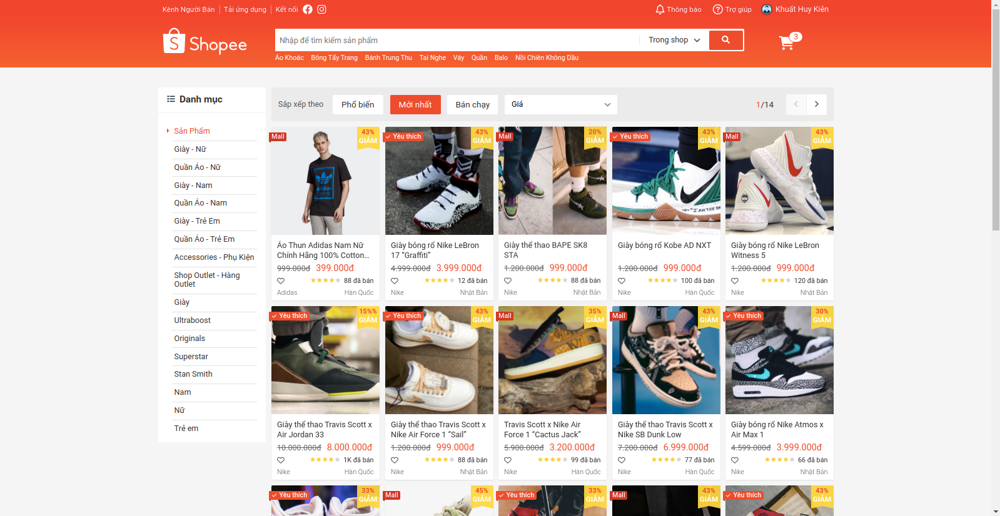
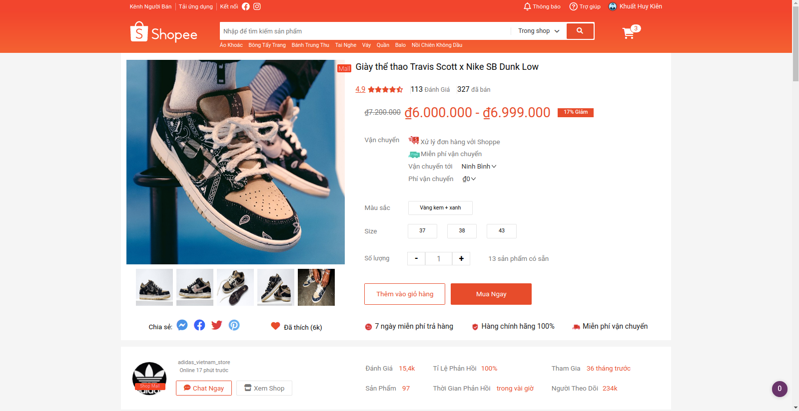

# Welcome to the Shopee clone project!

## Introduction
The website that we are about to clone is Shopee website. This is a personal project for understanding how to use HTML, CSS and Javascript to build a website of your own. The project consist of the following parts: 

1. The static frontend uses HTML/CSS and a web template for the objects.
2. In the process of developing more features of the website

### Authors
- [Khuat Huy Kien](https://github.com/kiensamson0000)